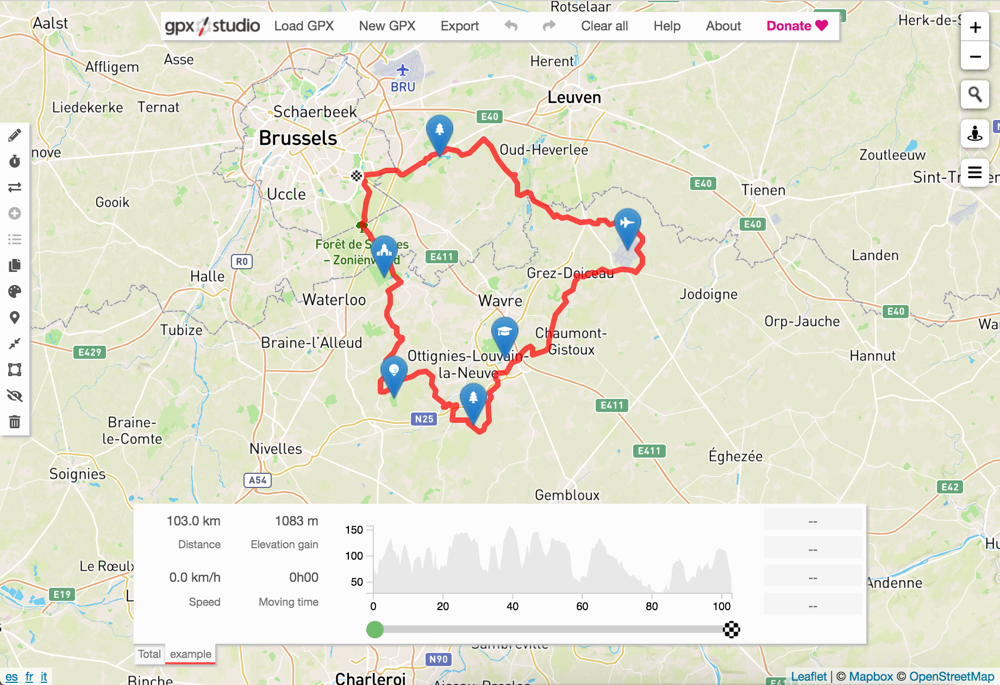

This repository contains the source code of the website [gpx.studio](https://gpx.studio), an online tool for GPX editing.

## Run the code

To play with the code locally:
* Get your own tokens at [Mapbox](https://www.mapbox.com/) and [GraphHopper](https://www.graphhopper.com/) and put them in `res/keys.json`.
* Launch a local server in the root directory, for example using `python3 -m http.server`.

## Features

* Load, edit and create new GPX files
* Change the starting time and speed of the activity
* Reverse the direction of a trace
* Reduce the number of track points
* Merge multiple traces together
* Support for waypoints: place and drag, edit information, duplicate
* Support for track segments (`<trkseg>`) : extraction with smart waypoints matching and merge as track segments
* Delete points and/or waypoints inside or outside a rectangle selection
* Export multiple traces as one or separately in the chosen order and respecting time precedence constraints (if any time data)
* Preserve and automatically extend speed, heart rate, cadence, power and temperature data
* Drag and drop to load and export files
* Support as many traces as you want with scrollable tabs
* Google Drive integration and [add-on](https://gsuite.google.com/marketplace/app/gpxstudio_the_online_gpx_editor/666808960580): select a file, save the new version and get a shareable link as well as code to embed the map

## Contributing

If you think something is missing from the website, please create an issue to discuss it or make a pull request if you can implement it yourself.

## Translation

The website is translated by volunteers on a collaborative translation platform.
You can help complete and improve the translations by joining the [Crowdin project](https://crowdin.com/project/gpxstudio).
If you would like to start the translation in a new language, contact me or create an issue.
Apart from a good understanding of **gpx.studio**, some basic knowledge of HTML can be useful. Any help is greatly appreciated!

## Acknowledgements

This project would not have been possible without the following amazing projects:
* [Leaflet](https://leafletjs.com/): awesome map library
* [leaflet-gpx](https://github.com/mpetazzoni/leaflet-gpx): parsing GPX files
* [Leaflet.Heightgraph](https://github.com/GIScience/Leaflet.Heightgraph): elevation profile
* [Leaflet.Icon.Glyph](https://github.com/Leaflet/Leaflet.Icon.Glyph): markers with icons for the waypoints
* [Leaflet.TextPath](https://github.com/makinacorpus/Leaflet.TextPath): direction markers
* [leaflet-distance-markers](https://github.com/adoroszlai/leaflet-distance-markers): distance markers
* [leaflet-control-window](https://github.com/mapshakers/leaflet-control-window): centered windows for all dialogs
* [leaflet-control-geocoder](https://github.com/perliedman/leaflet-control-geocoder): search for locations with chosen API
* [tilebelt](https://github.com/mapbox/tilebelt): find correct tiles to request and access elevation data
* [PNG.js](https://github.com/arian/pngjs): read raw PNG data to decode elevation from [Mapbox Terrain-RGB tiles](https://docs.mapbox.com/help/troubleshooting/access-elevation-data/#mapbox-terrain-rgb)
* [simplify2](https://github.com/geonome/simplify2-js): line simplification algorithm
* [js-xss](https://github.com/leizongmin/js-xss): HTML sanitizer for waypoint text fields
* [SortableJS](https://github.com/SortableJS/Sortable): for swapping the tabs
* [Font Awesome](https://fontawesome.com/): nice icons

And the data, maps and APIs from [Mapbox](https://www.mapbox.com/), [GraphHopper](https://www.graphhopper.com/), [OpenStreetMap](https://www.openstreetmap.org/), [OpenTopoMap](https://opentopomap.org/), [Maps.Refuges.Info](https://wiki.openstreetmap.org/wiki/Hiking/mri), [CyclOSM](https://www.cyclosm.org/), [IGN](https://geoservices.ign.fr/) and [Strava](https://strava.com).
